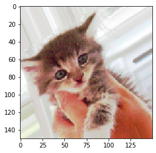
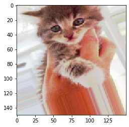
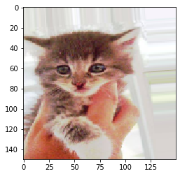
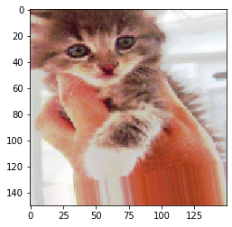

# Convolutional Neural Nets

This Learn-by-building will cover the following topics:

Apply what you have learnt, present a Jupyter notebook to demonstrate neural network modelling. You can use neural network tools of your choice and the datasets from MNIST (keras) and Cats and Dogs Small from Kaggle.

Tasks to be performed 

-  design neural network layer design for input, hidden, output layer, and activation functions.

-  demonstrate cross validation method and model evaluation.

Section

* [MNIST](#1)
    * [The Convolution Operation](#11)
    * [The Max-pooling Operation](#12)
* [Cats and Dogs](#2)
    * [Data preparation](#21)
* [Data Augmentation](#part3) 
* [References and Acknowledgements](#references)


<a id='1'></a>
## 1 - MNIST

<a id='part11'></a>
### 1.1 - The Convolution Operation

We use a Convolutional Neural Net (CNN) to operate on the MNIST dataset.


#### Setting up  a convnet


```python
%matplotlib inline
from keras import layers 
from keras import models
model = models.Sequential()
model.add(layers.Conv2D(32, (3, 3), activation='relu', input_shape=(28, 28, 1)))
model.add(layers.MaxPooling2D((2, 2)))
model.add(layers.Conv2D(64, (3, 3), activation='relu')) 
model.add(layers.MaxPooling2D((2, 2)))
model.add(layers.Conv2D(64, (3, 3), activation='relu'))
```

    Using TensorFlow backend.
    

A convnet takes as input tensors of shape `(image_height, image_width, image_channels)`. In this case, we will configure the convnet to process inputs of size `(28, 28, 1)`, which is the format of MNIST images. We will do this by passing the argument `input_shape=(28, 28, 1)` to the first layer.

We can see that the output of every `Conv2D` and `MaxPooling2D` layer is a 3D tensor of shape `(height, width, channels)`. The width and height dimensions tend to shrink as they go deeper in the network. The number of channels is controlled by the first argument passed to the `Conv2D` layers (32 or 64).

The next step is to feed the last output tensor (of shape `(3, 3, 64)`) into a stack of `Dense` layers. These classifiers process vectors, which are 1D, whereas the current output is a 3D tensor. First we have to flatten the 3D outputs to 1D, and then add a few `Dense` layers on top.


```python
model.add(layers.Flatten())
model.add(layers.Dense(64, activation='relu'))
model.add(layers.Dense(10, activation='softmax'))

model.summary()
```

    Model: "sequential_1"
    _________________________________________________________________
    Layer (type)                 Output Shape              Param #   
    =================================================================
    conv2d_1 (Conv2D)            (None, 26, 26, 32)        320       
    _________________________________________________________________
    max_pooling2d_1 (MaxPooling2 (None, 13, 13, 32)        0         
    _________________________________________________________________
    conv2d_2 (Conv2D)            (None, 11, 11, 64)        18496     
    _________________________________________________________________
    max_pooling2d_2 (MaxPooling2 (None, 5, 5, 64)          0         
    _________________________________________________________________
    conv2d_3 (Conv2D)            (None, 3, 3, 64)          36928     
    _________________________________________________________________
    flatten_1 (Flatten)          (None, 576)               0         
    _________________________________________________________________
    dense_1 (Dense)              (None, 64)                36928     
    _________________________________________________________________
    dense_2 (Dense)              (None, 10)                650       
    =================================================================
    Total params: 93,322
    Trainable params: 93,322
    Non-trainable params: 0
    _________________________________________________________________
    

We can observe `(3, 3, 64)` outputs are flattened into vectors of shape `(576,)` before going through two `Dense` layers.
Now, we will train the convnet on the MNIST digits. 


```python
from keras.datasets import mnist
from keras.utils import to_categorical
(train_images, train_labels), (test_images, test_labels) = mnist.load_data()

train_images = train_images.reshape((60000, 28, 28, 1))
train_images = train_images.astype('float32') / 255
test_images = test_images.reshape((10000, 28, 28, 1))
test_images = test_images.astype('float32') / 255
train_labels = to_categorical(train_labels)
test_labels = to_categorical(test_labels)
model.compile(optimizer='rmsprop',
              loss='categorical_crossentropy',
              metrics=['accuracy'])
model.fit(train_images, train_labels, epochs=5, batch_size=64)

#  evaluate the model on the test data:

test_loss, test_acc = model.evaluate(test_images, test_labels)
test_acc
```

    Epoch 1/5
    60000/60000 [==============================] - 28s 468us/step - loss: 0.1770 - accuracy: 0.9447
    Epoch 2/5
    60000/60000 [==============================] - 29s 478us/step - loss: 0.0479 - accuracy: 0.9856
    Epoch 3/5
    60000/60000 [==============================] - 28s 464us/step - loss: 0.0339 - accuracy: 0.9897
    Epoch 4/5
    60000/60000 [==============================] - 28s 469us/step - loss: 0.0259 - accuracy: 0.9922
    Epoch 5/5
    60000/60000 [==============================] - 29s 478us/step - loss: 0.0204 - accuracy: 0.9940
    10000/10000 [==============================] - 2s 161us/step
    


    0.9894000291824341


The basic convnet has a test accuracy of 99.2% with only 5 epochs. 

<a id='12'></a>
### 1.2 - The Max-pooling Operation

As shown in the model summary above, the first convolution layer takes a feature map of size `(28, 28, 1)` and outputs a feature map of size `(26, 26, 32)`: it computes 32 filters over its input. Each of these 32 output channels contains a $26 \times 26$ grid of values, which is a *response map* of the filter over the input, indicating the response of that filter pattern at different locations in the input. That is what the term *feature map* means: every dimension in the depth axis is a feature (or filter), and the 2D tensor `output[:, :, n]` is the 2D spatial *map* of the response of this filter over the input.

Convolutions are defined by two key parameters:
* *Size of the patches extracted from the inputs* - These are typically $3 \times 3$ or $5 \times 5$. In the example, they were $3 \times 3$, which is a common choice.
* *Depth of the output feature map*  - The number of filters computed by the convolution. The example started with a depth of 32 and ended with a depth of 64.

In Keras `Conv2D` layers, these parameters are the first arguments passed to the layer: `Conv2D(output_depth, (window_height, window_width))`.

A convolution works by *sliding* these windows of size $3 \times 3$ or $5 \times 5$ over the 3D input feature map, stopping at every possible location, and extracting the 3D patch of surrounding features (shape `(window_height, window_width, input_depth)`). Each such 3D patch is then transformed (via a tensor product with the same learned weight matrix, called the *convolution kernel* ) into a 1D vector of shape `(output_depth,)`. All of these vectors are then spatially reassembled into a 3D output map of shape `(height, width, output_depth)`. Every spatial location in the output feature map corresponds to the same location in the input feature map (for example, the lower-right corner of the output contains information about the lower-right corner of the input). For instance, with $3 \times 3$ windows, the vector `output[i, j, :]` comes from the 3D patch `input[i-1:i+1,j-1:j+1,:]`. In the convnet, we may have noticed that the size of the feature maps is halved after every `MaxPooling2D` layer. For instance, before the first `MaxPooling2D` layers, the feature map is $26 \times 26$, but the max-pooling operation halves it to $13 \times 13$. That’s the role of max pooling: to aggressively **downsample** feature maps.

Max pooling consists of extracting windows from the input feature maps and outputting the max value of each channel. It is conceptually similar to convolution, except that instead of transforming local patches via a learned linear transformation (the convolution kernel), they are transformed via a hardcoded `max` tensor operation. A big difference from convolution is that max pooling is usually done with $2 \times 2$ windows and stride 2, in order to downsample the feature maps by a factor of 2. On the other hand, convolution is typically done with $3 \times 3$ windows and no stride (stride 1).

<a id='2'></a>
## 2 - Cats and Dogs Small dataset


<a id='21'></a>
### 2.1 - The Convolution Operation

We will focus on classifying images as cats or dogs, in a dataset containing 4,000 pictures of cats and dogs (2,000 cats, 2,000 dogs). We will use 2,000 pictures for training: 1,000 for validation, and 1,000 for testing.

Here, we will train a new model by training a small convnet on the 2,000 training samples, without any regularization, to set a baseline for what can be achieved. This will get us to a classification accuracy of 71%. The issue is one of overfitting. Using *data augmentation*, we will try to improve the network to reach an accuracy of 82%.


<a id='22'></a>
### 2.2 - Data Preparation


The Cats and Dogs Small dataset is available by Kaggle [https://www.kaggle.com/zeegelin/cats-and-dogs-small/download](https://www.kaggle.com/zeegelin/cats-and-dogs-small/download) 

The pictures are medium-resolution color JPEGs. The dataset containing three subsets has been created for you: a training set with 1,000 samples of each class, a validation set with 500 samples of each class, and a test set with 500 samples of each class.


```python
# set base dir
base_dir = 'cats_and_dogs_small'

import os, shutil

train_dir = os.path.join(base_dir, 'train')
validation_dir = os.path.join(base_dir, 'validation')
test_dir = os.path.join(base_dir, 'test')
train_cats_dir = os.path.join(train_dir, 'cats')
train_dogs_dir = os.path.join(train_dir, 'dogs')
validation_cats_dir = os.path.join(validation_dir, 'cats')
validation_dogs_dir = os.path.join(validation_dir, 'dogs')
test_cats_dir = os.path.join(test_dir, 'cats')
test_dogs_dir = os.path.join(test_dir, 'dogs')

print('total training cat images:', len(os.listdir(train_cats_dir))) 
print('total training dog images:', len(os.listdir(train_dogs_dir))) 
print('total validation cat images:', len(os.listdir(validation_cats_dir)))
print('total validation dog images:', len(os.listdir(validation_dogs_dir)))
print('total test cat images:', len(os.listdir(test_cats_dir))) 
print('total test dog images:', len(os.listdir(test_dogs_dir))) 

```


    ---------------------------------------------------------------------------

    FileNotFoundError                         Traceback (most recent call last)

    <ipython-input-4-97a85ec00aa6> in <module>
         14 test_dogs_dir = os.path.join(test_dir, 'dogs')
         15 
    ---> 16 print('total training cat images:', len(os.listdir(train_cats_dir)))
         17 print('total training dog images:', len(os.listdir(train_dogs_dir)))
         18 print('total validation cat images:', len(os.listdir(validation_cats_dir)))
    

    FileNotFoundError: [WinError 3] The system cannot find the path specified: 'cats_and_dogs_small\\train\\cats'


We do indeed have 2,000 training images, 1,000 validation images, and 1,000 test images. Each split contains the same number of samples from each class: this is a balanced binary-classification problem, which means classification accuracy will be an appropriate measure of success.

<a id='23'></a>
### 2.3 - Building network

Based on the small convnet for MNIST example, we will reuse the same general structure: the convnet will be a stack of alternated `Conv2D` (with `relu` activation) and `MaxPooling2D` layers.

Since we are dealing with bigger images and a more complex problem in the case of Cats and Dogs dataset, this will make the network larger: it will have one more `Conv2D + MaxPooling2D` stage. This will serve to augment the capacity of the network and further reduce the size of the feature maps so they will not be overly large when this reach the `Flatten` layer. Here, because we start from inputs of size $150 \times 150$ (a somewhat arbitrary choice), we will end up with feature maps of size $7 \times 7$ just before the Flatten layer.

The depth of the feature maps progressively increases in the network (from 32 to 128), whereas the size of the feature maps decreases (from $148 \times 148$ to $7 \times 7$). 

We are solving a binary-classification problem, we will end the network with a single unit (a `Dense` layer of size 1) and a `sigmoid` activation. This unit will encode the probability that the network is looking at one class or the other.


```python
from keras import layers
from keras import models
model = models.Sequential()
model.add(layers.Conv2D(32, (3, 3), activation='relu',
                        input_shape=(150, 150, 3)))
model.add(layers.MaxPooling2D((2, 2)))
model.add(layers.Conv2D(64, (3, 3), activation='relu'))
model.add(layers.MaxPooling2D((2, 2)))
model.add(layers.Conv2D(128, (3, 3), activation='relu'))
model.add(layers.MaxPooling2D((2, 2)))
model.add(layers.Conv2D(128, (3, 3), activation='relu'))
model.add(layers.MaxPooling2D((2, 2)))
model.add(layers.Flatten())
model.add(layers.Dense(512, activation='relu'))
model.add(layers.Dense(1, activation='sigmoid'))
model.summary()
```

For the compilation step, we will use the `RMSprop` optimizer and `binary crossentropy` as the loss.


```python
from keras import optimizers
model.compile(loss='binary_crossentropy',
                      optimizer=optimizers.RMSprop(lr=1e-4),
                      metrics=['acc'])
```

<a id='24'></a>
### 2.4 - Data Preprocessing

Using Keras module with image-processing helper tools, located at `keras.preprocessing.image`, the class ImageDataGenerator quickly turn image files on disk into batches of preprocessed tensors. 


```python
from keras.preprocessing.image import ImageDataGenerator
train_datagen = ImageDataGenerator(rescale=1./255)
test_datagen = ImageDataGenerator(rescale=1./255)

train_generator = train_datagen.flow_from_directory(
        train_dir,
        target_size=(150, 150),
        batch_size=20,
        class_mode='binary')

validation_generator = test_datagen.flow_from_directory(
        validation_dir,
        target_size=(150, 150),
        batch_size=20,
        class_mode='binary')
```

It yields batches of $150 \times 150$ RGB images (shape `(20, 150, 150, 3)`) and binary labels (shape `(20,)`). There are 20 samples in each batch (the batch size). Note that the generator loops endlessly over the images in the target folder. For this reason, we need to break the iteration loop at some point:


```python
for data_batch, labels_batch in train_generator:
    print('data batch shape:', data_batch.shape)
    print('labels batch shape:', labels_batch.shape)
    break
```

Let’s fit the model to the data using the generator. We will do so using the `fit_generator` method, the equivalent of `fit` for data generators. It expects as its first argument a Python generator that will yield batches of inputs and targets indefinitely. Because the data is being generated endlessly, the Keras model needs to know how many samples to draw from the generator before declaring an epoch over. This is the role of the steps_per_epoch argument: after having drawn `steps_per_epoch` batches from the generator—that is, after having run for `steps_per_epoch` gradient descent steps - the fitting process will go to the next epoch. In this case, batches are 20 samples, so it will take 100 batches until achieving the target of 2,000 samples.

When using `fit_generator`, we can pass a `validation_data` argument, much as with the `fit` method. It’s important to note that this argument is allowed to be a data generator, but it could also be a tuple of Numpy arrays. If we pass a generator as `validation_data`, then this generator is expected to yield batches of validation data endlessly; thus we should also specify the `validation_steps` argument, which tells the process how many batches to draw from the validation generator for evaluation


```python
history = model.fit_generator(
      train_generator,
      steps_per_epoch=100,
      epochs=20, # should be 30
      validation_data=validation_generator,
      validation_steps=50)


# save models after training.
model.save('cats_and_dogs_small_1.h5')
```

Let’s plot the loss and accuracy of the model over the training and validation data during training:


```python
import matplotlib.pyplot as plt
acc = history.history['acc']
val_acc = history.history['val_acc']
loss = history.history['loss']
val_loss = history.history['val_loss']
epochs = range(1, len(acc) + 1)
plt.plot(epochs, acc, 'bo', label='Training acc')
plt.plot(epochs, val_acc, 'b', label='Validation acc')
plt.title('Training and validation accuracy')
plt.legend()
plt.figure()
plt.plot(epochs, loss, 'bo', label='Training loss')
plt.plot(epochs, val_loss, 'b', label='Validation loss')
plt.title('Training and validation loss')
plt.legend()
plt.show()
```

These plots are characteristic of overfitting. The training accuracy increases linearly over time, until it reaches nearly 100%, whereas the validation accuracy stalls at 70–74%. The validation loss reaches its minimum after only five epochs and then stalls, whereas the training loss keeps decreasing linearly until it reaches nearly 0.

Since we have relatively few training samples (2,000), overfitting will be our key concern. We can make use of dropout and weight decay (L2 regularization) techniques to address overfitting. 

Instead, we will make use of *data augmentation* when processing images with deep-learning models.

<a id='3'></a>
## 3 - Data Augmentation

Overfitting is caused by having too few samples to learn from, rendering you unable to train a model that can generalize to new data. 

Given infinite data, our model would be exposed to every possible aspect of the data distribution at hand: we would never overfit. 

Data augmentation takes the approach of generating more training data from existing training samples, by *augmenting* the samples via a number of random transformations that yield believable-looking images. 

The goal is that at training time, our model will never see the exact same picture twice. This helps expose the model to more aspects of the data and generalize better.

In Keras, this can be done by configuring a number of random transformations to be performed on the images read by the `ImageDataGenerator` instance. Let’s get started with an example.


```python
datagen = ImageDataGenerator(
      rotation_range=40,
      width_shift_range=0.2,
      height_shift_range=0.2,
      shear_range=0.2,
      zoom_range=0.2,
      horizontal_flip=True,
      fill_mode='nearest')
```

These are just a few of the options available (for more, see the Keras documentation). Let’s quickly go over this code:
* `rotation_range` is a value in degrees (0–180), a range within which to randomly rotate pictures.
* `width_shift` and `height_shift` are ranges (as a fraction of total width or height) within which to randomly translate pictures vertically or horizontally.
* `shear_range` is for randomly applying shearing transformations.
* `zoom_range` is for randomly zooming inside pictures.
* `horizontal_flip` is for randomly flipping half the images horizontally—relevant when there are no assumptions of horizontal asymmetry (for example, real-world pictures).
* `fill_mode` is the strategy used for filling in newly created pixels, which can
appear after a rotation or a width/height shift. Let’s look at the augmented images 


```python
from keras.preprocessing import image
fnames = [os.path.join(train_cats_dir, fname) for
     fname in os.listdir(train_cats_dir)]
img_path = fnames[3]  # chooses one image to augment
img = image.load_img(img_path, target_size=(150, 150))
# read the image and resizes it
x = image.img_to_array(img) # convert it to a Numpy array with shape (150, 150, 3) 
x = x.reshape((1,) + x.shape) # Reshapes it to (1, 150, 150, 3)
i=0
for batch in datagen.flow(x, batch_size=1):
    plt.figure(i)
    imgplot = plt.imshow(image.array_to_img(batch[0]))
    i += 1
    if i % 4 == 0:
        break
plt.show()

```














If we train a new network using this data-augmentation configuration, the network will never see the same input twice. But the inputs it sees are highly intercorrelated, because they come from a small number of original images. To further fight overfitting, we will add a `Dropout` layer to our model, right before the densely connected classifier.


```python
model = models.Sequential()
model.add(layers.Conv2D(32, (3, 3), activation='relu',
                        input_shape=(150, 150, 3)))
model.add(layers.MaxPooling2D((2, 2)))
model.add(layers.Conv2D(64, (3, 3), activation='relu'))
model.add(layers.MaxPooling2D((2, 2)))
model.add(layers.Conv2D(128, (3, 3), activation='relu'))
model.add(layers.MaxPooling2D((2, 2)))
model.add(layers.Conv2D(128, (3, 3), activation='relu'))
model.add(layers.MaxPooling2D((2, 2)))
model.add(layers.Flatten())
model.add(layers.Dropout(0.5))
model.add(layers.Dense(512, activation='relu'))
model.add(layers.Dense(1, activation='sigmoid'))
model.compile(loss='binary_crossentropy',
              optimizer=optimizers.RMSprop(lr=1e-4),
              metrics=['acc'])

```


```python
# train the network using data augmentation and dropout.

train_datagen = ImageDataGenerator(
    rescale=1./255,
    rotation_range=40,
    width_shift_range=0.2,
    height_shift_range=0.2,
    shear_range=0.2,
    zoom_range=0.2,
    horizontal_flip=True,)
test_datagen = ImageDataGenerator(rescale=1./255)
# Note that the validation data shouldn’t be augmented!
train_generator = train_datagen.flow_from_directory(
    train_dir,
    target_size=(150, 150),
    batch_size=32,
    class_mode='binary')

validation_generator = test_datagen.flow_from_directory(
        validation_dir,
        target_size=(150, 150),
        batch_size=32,
        class_mode='binary')
history = model.fit_generator(
      train_generator,
      steps_per_epoch=100,
      epochs=18, # should be 100
      validation_data=validation_generator,
      validation_steps=50)

model.save('cats_and_dogs_small_2.h5')
```

And let’s plot the results again. Thanks to data augmentation and dropout. The training curves are closely placed to the validation curves. You now reach an accuracy of 82%, a 15% relative improvement over the non-regularized model.


```python
acc = history.history['acc']
val_acc = history.history['val_acc']
loss = history.history['loss']
val_loss = history.history['val_loss']
epochs = range(1, len(acc) + 1)
plt.plot(epochs, acc, 'bo', label='Training acc')
plt.plot(epochs, val_acc, 'b', label='Validation acc')
plt.title('Training and validation accuracy with data augmentation')
plt.legend()
plt.figure()
plt.plot(epochs, loss, 'bo', label='Training loss')
plt.plot(epochs, val_loss, 'b', label='Validation loss')
plt.title('Training and validation loss with data augmentation')
plt.legend()
plt.show()
```


By using regularization techniques even further, and by tuning the network’s parameters (such as the number of filters per convolution layer, or the number of layers in the network), we may be able to get an even better accuracy, likely up to 86% or 87%. 

<a id='references'></a>
### References and Acknowledgements

* [Deep Learning with Python](https://www.manning.com/books/deep-learning-with-python), Chapter 5 written by the Francois Chollet, the author of Keras. 


```python

```
